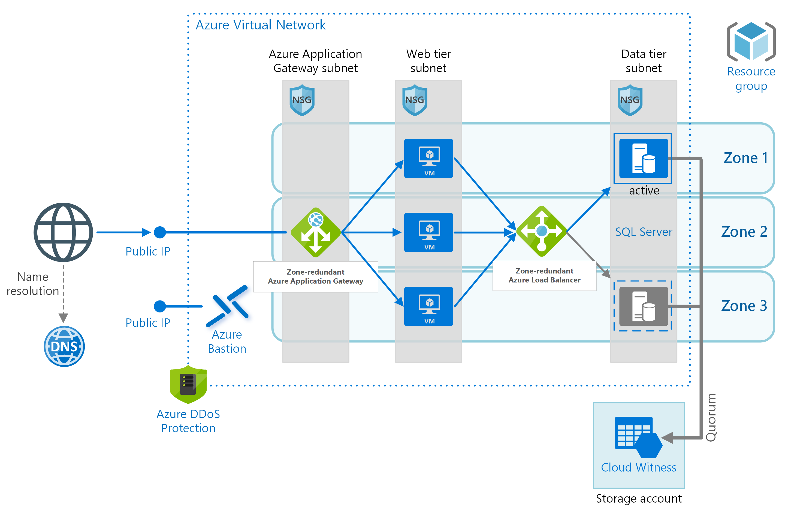

# Advanced Infrastructure - Personal Project

A terraform solution for deploying the following infrastructure in Azure.

Todo:
* security group for webtier
* webtier autoscaling group
* bastion vm
* load balancer 
* dbtier
* ci/cd for webtier (optional)
* simple ui 
* variables from ui
